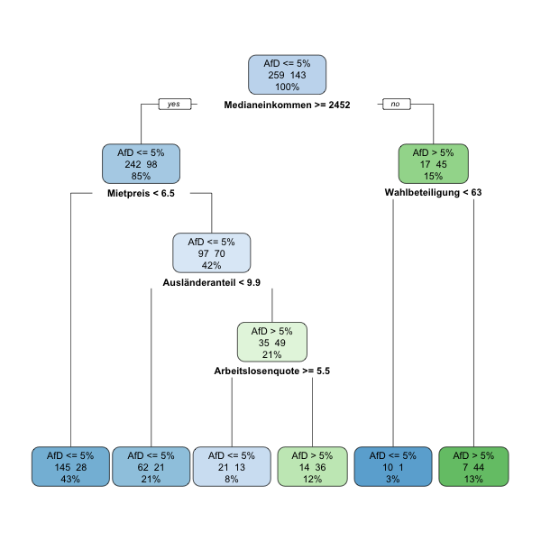

Dies ist das Praxisbeispiel zum #NR17-Workshop (http://sched.co/AHAe) und zum zugehörigen Blogartikel (http://www.digitalerwandel.de/2017/06/09/machine-learning-fuer-journalisten/). Es wird gezeigt, wie ein Decision Tree / Entscheidungsbaum auf einem Beispieldatensatz gelernt werden kann. Die Methode ist analog zu [Decision Tree: The Obama-Clinton Divide](http://www.nytimes.com/imagepages/2008/04/16/us/20080416_OBAMA_GRAPHIC.html) wovon das Beispiel inspiriert ist.

## Setup

Wir verwenden für das Training und die Evaluation des Baums vor allem [caret](https://github.com/topepo/caret). Dann laden wir noch ein paar Pakete zum Data Wrangling (dplyr), plotten (ggplot2, gganimate) und Algorithmen (rpart, xgboost).

```{r, Setup}
# Pakete installieren
# install.packages('needs')
library(needs)
needs(caret, ggplot2, plyr, dplyr, rpart, rpart.plot, xgboost, scales, knitr, devtools)
devtools::install_github("dgrtwo/gganimate")
library(gganimate)
```

## Daten

Die Daten stammen von der Bundeswahlleitung, Correctiv/empirica und vom Bundesinstitut für Bau-, Stadt- und Raumforschung (BBSR).

```{r}
# Zweitstimmen der Bundestagswahl 2013 und soziodemographische Daten laden
d <- read.csv('ml-workshop-daten.csv')
d
```

In unserem Beispiel, wollen wir einen Baum trainieren, der Wahlkreise identifiziert, in denen die AfD mehr als fünf Prozent der Zweitstimmen erhalten hat. Dafür benötigen wir eine Dummyvariable `AfD <= 5%`. Oft kodiert man diese explizit mit 1 = `AfD <= 5%` und 0 = `AfD <= 5%`, in R können wir aber einfach einen `factor` mit zwei Ausprägungen erstellen. Wir entfernen danach noch alle Informationen zu den Zweitstimmen aus dem Datensatz und behalten nur noch mögliche Prädiktoren und die Zielvariable `factor_party` übrig.

```{r}
d$factor_party <- factor(with(d,ifelse((AfD <= 5), "AfD <= 5%", "AfD > 5%")))
d = d[,35:45]
d
```

## Was ist ein Decision Tree / Einführung

Ein Entscheidungsbaum ist ein Baum in dessen Gabelungen Entscheidungsregeln stehen wie z.B. "Ist das Medianeinkommen >= 2452 Euro". Je nach Antwort geht man nach links oder rechts den Baum weiter bis man in einem Blatt angelangt ist. Im Blatt steht dann die Vorhersage "AfD >= 5%" oder "AfD < 5%".

Das könnte zum Beispiel so aussehen:
```{r}

```


### Aufteilung der Trainingsdaten

Aber wie funktioniert das Training eines solchen Baumes? Wählen wir ein Attribut aus den Daten, z.B. das Medianeinkommen, können wir dieses gegen die Zielvariable plotten. Nun können wir einen Wert festlegen und immer wenn das Medianeinkommen kleiner ist "AfD > 5%" vorhersagen und sonst "AfD >= 5%".

```{r}
d %>% ggplot() +
  geom_point(aes(factor_party, Medianeinkommen, color=factor_party), alpha = 0.5) +
  geom_hline(yintercept = 2452, linetype = 2)
```

Aber wie finden wir den geeigneten Wert für den "Split"? Dafür können wir einfach alle Werte ausprobieren und die Genauigkeit (Accuracy) des resultierenden Modells betrachten. Die folgende Animation stellt dies dar:

```{r, warning=FALSE}
accuracy = d %>%
  rowwise() %>%
  do(accuracy=sum((.$Medianeinkommen>=d$Medianeinkommen)==(d$factor_party=="AfD > 5%"))/nrow(d)) %>%
  ungroup() %>% .$accuracy %>% unlist

frames = d %>%
  mutate(accuracy = percent(accuracy)) %>% sample_n(30)

animation = d %>%
  ggplot() +
  geom_point(aes(factor_party, Medianeinkommen, color=factor_party), alpha = 0.5) +
  geom_hline(aes(yintercept = Medianeinkommen, frame=-Medianeinkommen), linetype = 2, data = frames) +
  geom_text(aes(y = Medianeinkommen, label=paste("Medianeinkommen >=", Medianeinkommen, "Accuracy:", accuracy), frame=-Medianeinkommen), x = 1, hjust = 0, vjust = -.5, data = frames)

gganimate(animation, interval = .5)
```

Stattdessen können wir uns auch einen Plot "Split bei Medianeinkommen x" gegen die Genauigkeit des resultierenden Modells anssehen.

```{r}
d %>%
  mutate(accuracy = accuracy) %>%
  arrange(Medianeinkommen) %>%
  ggplot() +
  geom_line(aes(Medianeinkommen, as.numeric(accuracy)))
```

Nun haben wir einen sehr einfachen Entscheidungsbaum mit nur einer Gabelung und zwei Blättern. Wie macht man nun weiter?

### Rekursive Aufteilung der Trainingsdaten

In jedem Blatt befindet sich nun ein Teil der Trainingsdaten. Auf diesem Teil kann man genau dasselbe Verfahren nun wiederholen. Z.B. auf dem Teil mit Medianeinkommen < 2452 könnten wir die Wahlbeteiligung betrachten und wieder (nach demselben Prinzip wie vorher) einen Wert festlegen an dem ein Split stattfinden soll.

```{r}
d %>% filter(Medianeinkommen < 2452) %>%
  ggplot() +
  geom_point(aes(factor_party, Wahlbeteiligung, color=factor_party), alpha = 0.5) +
  geom_hline(yintercept = 63, linetype = 2)
```

Auf diese Weise wir der "Merkmalsraum" in immer feinere Würfel eingeteilt, die immer "reiner" sind, d.h. sie enthalten größtenteils Datenpunkte einer einzigen Klasse.

```{r}
d %>% ggplot() +
  geom_point(aes(Wahlbeteiligung, Medianeinkommen, color=factor_party)) +
  geom_hline(yintercept = 2452, linetype = 2) +
  geom_segment(x=63, xend=63, y = 0, yend = 2452, linetype = 2)
```

## Model Building

Nun wollen wir das Modell trainieren. Dafür wählen wir als erstes die Merkmale aus, die wir als Prädiktoren verwenden wollen. Dies können wir in Form einer [R-Formel](https://stat.ethz.ch/R-manual/R-devel/library/stats/html/formula.html) tun bei der auf der linken Seite die Zielvariable steht und getrennt durch ein `~` auf der Rechten Seite die Prädiktoren.

```{r}
variables <- factor_party ~ Wahlbeteiligung + Medianeinkommen + Arbeitslosenquote + Ausländeranteil + Mietpreis
# variables <- factor_party ~ Wahlbeteiligung + ost_west + Medianeinkommen + Arbeitslosenquote + Ausländeranteil + Mietpreis
# variables <- factor_party ~ .
d_clean <- na.omit(d) %>% select(Wahlbeteiligung:factor_party) # NA-Werte löschen 
```

Das eigentliche Training findet mit der `train`-Methode aus `caret` statt. Wir initalisieren vorher den Zufallszahlengenerator mittels `set.seed` um reproduzierbare Ergebnisse zu bekommen. Wer legen außerdem Crossvalidation als Evaluationsmethode fest und geben die Anzahl der Hyperparameterkombinationen an, die wir probieren wollen. Hyperparameter sind Modellparameter, die bei Bäumen z.B. festlegen, wie tief der Baum maximal werden darf.

```{r}
set.seed(123)
tc <- trainControl(method = "cv", number = 10) # Daten zufällig in zehn ähnlich große Blöcke aufteilen
train.rpart <- train(variables, data=d_clean, method="rpart", tuneLength=10, metric="Accuracy", trControl=tc) # Metric "Accuracy" für Classification, "Rsquared" für Regression
```

Wenn wir uns das trainierte Modell ausgeben lassen, können wir sehen welche Genauigkeit für welchen Wert des Komplexitätsparameters cp (bestimmt, wie tief der Baum werden kann) erreicht wird.

```{r}
train.rpart
```

Wir können uns außerdem den Baum ausgeben lassen:

```{r}
rpart.plot(train.rpart$finalModel, extra=101)
```

`caret` bietet bei Baummodellen außerdem eine Funktion, die Wichtigkeit der Merkmale für das Modell grafisch auszugeben:

```{r}
plot(varImp(train.rpart, competes=F))
```

## Andere Modelle

Wir haben den Entscheidungsbaum zwar explizit ausgewählt, weil er interpretiertbar ist, wollen jedoch noch kurz zeigen, dass es mit `caret` sehr einfach ist, komplexere Modelle zu verwenden. Die Funktionsaufrufe sind fast identisch. Hier trainieren wir zusätzlich zu einem Entschedungsbaum ein Modell namens [Gradient Boosting Machine]() aus dem [XGBoost-Paket](http://xgboost.readthedocs.io/en/latest/model.html). Dieses hat eine Vielzahl von Hyperparametern und ist nicht mehr so einfach darstellbar und interpretierbar wie ein einzelner Entscheidungsbaum.

```{r}
variables <- factor_party ~ .
set.seed(123)
train.rpart <- train(variables, data=d_clean, method="rpart", tuneLength=10, metric="Accuracy", trControl=tc)
train.xgbTree <- train(variables, data=d_clean, method="xgbTree", tuneLength=4, metric="Accuracy", trControl=tc)
```

Die Genauigkeit dieses Modells ist tatsächlich etwas besser, als die eines Entscheidungsbauems.

```{r}
summary(resamples(list(CART=train.rpart, XGB=train.xgbTree)))
bwplot(resamples(list(CART=train.rpart, XGB=train.xgbTree)))
```

